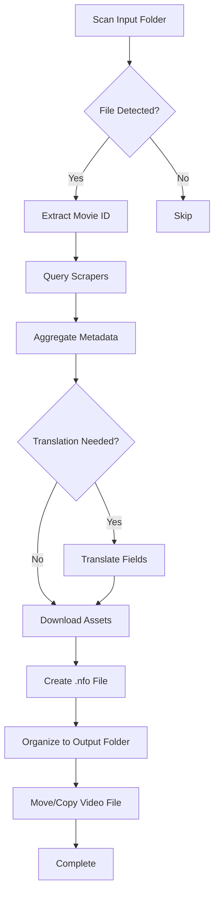

# Phân tích Dự án Javinizer (PowerShell)

> **Nguồn**: [https://github.com/javinizer/Javinizer](https://github.com/javinizer/Javinizer)  
> **Tài liệu**: [https://javinizer.gitbook.io/docs/](https://javinizer.gitbook.io/docs/)  
> **Ngày phân tích**: 2026-01-14

---

## 1. Tổng quan dự án

**Javinizer** là một module PowerShell được thiết kế để tổ chức thư viện phim JAV (Japanese Adult Video) cục bộ. Công cụ này tự động scrape metadata từ nhiều nguồn trực tuyến và sắp xếp các file video theo định dạng tương thích với các ứng dụng media library như Plex, Jellyfin, Emby.

### Mục tiêu chính

- Tự động hóa việc thu thập metadata cho file JAV
- Tổ chức file theo cấu trúc thư mục có thể tùy chỉnh
- Tạo file `.nfo` chứa metadata cho media server
- Hỗ trợ đa ngôn ngữ (English, Japanese, Chinese)
- Cho phép người dùng sở hữu dữ liệu metadata cục bộ

---

## 2. Kiến trúc và Công nghệ

### 2.1 Ngôn ngữ và Framework

- **PowerShell 7**: Ngôn ngữ chính cho module
- **Python 3**: Sử dụng cho các tác vụ xử lý ảnh và dịch thuật
- **PowerShell Universal**: Framework cho GUI dashboard

### 2.2 Dependencies chính

#### PowerShell

- PowerShell 7 (cross-platform)

#### Python

- **Pillow**: Xử lý và crop ảnh
- **googletrans >= 4.0.0rc1** hoặc **google_trans_new**: Dịch thuật metadata
- **MediaInfo** (Optional): Trích xuất thông tin media file

### 2.3 Deployment Options

1. **CLI (Command Line Interface)**: Module PowerShell truyền thống
2. **GUI (Graphical User Interface)**: Dashboard web qua PowerShell Universal
3. **Docker**: Container hóa cho cả CLI và GUI

---

## 3. Tính năng chính

### 3.1 Highly Customizable Scrapers

Javinizer hỗ trợ scraping từ nhiều nguồn khác nhau, cho phép mix-and-match metadata:

| Scraper | Mô tả | Ngôn ngữ hỗ trợ |
|---------|-------|-----------------|
| **Javlibrary** | Database JAV lớn nhất | EN, JP |
| **R18.dev** | Trang chính thức DMM (đã đóng cửa) | EN |
| **DMM (Fanza)** | Trang chính thức của nhà phát hành | JP |
| **JavBus** | Database JAV phổ biến | EN, JP, CN |
| **Jav321** | Database JAV | CN, JP |
| **AVEntertainment** | Database JAV | JP |
| **MGStage** | Nhà phát hành JAV | JP |
| **DLGetchu** | Nền tảng phân phối nội dung số | JP |

**Tính năng nổi bật**:

- Aggregated metadata: Kết hợp dữ liệu từ nhiều scraper theo priority
- CSV settings: Tùy chỉnh metadata thông qua file CSV
- Priority system: Chọn nguồn ưu tiên cho từng field metadata

### 3.2 Flexible File Detection

Nhiều phương pháp để detect file JAV:

1. **Built-in file matcher**: Tự động nhận diện ID từ tên file
2. **Custom regex**: Cho phép định nghĩa pattern riêng
3. **Direct URL**: Chỉ định trực tiếp URL scraper
4. **Recursive scanning**: Quét thư mục con

**Ví dụ pattern nhận diện**:

```
IPX-535.mp4
[IPX-535] Title.mp4
IPX-535-C.mp4
```

### 3.3 Multi-language Support

- **Native language**: Scraper hỗ trợ EN, JP, CN tùy nguồn
- **Machine translation**: Tích hợp Google Translate để dịch field metadata
- **Translatable fields**: Title, Description, Genre, Actor names
- **Language priority**: Cấu hình ngôn ngữ ưu tiên cho từng field

### 3.4 Metadata Ownership

**Tạo file `.nfo` cục bộ** với cấu trúc XML chuẩn Kodi/Plex:

```xml
<?xml version="1.0" encoding="UTF-8" standalone="yes"?>
<movie>
  <title>[IDBD-979] Yume Nishinomiya Ultimate Blowjoc Complete BEST</title>
  <originaltitle>西宮ゆめ 至高のフェラチオコンプリートBEST</originaltitle>
  <id>IDBD-979</id>
  <premiered>2020-09-12</premiered>
  <year>2020</year>
  <studio>Idea Pocket</studio>
  <plot>デビュー4周年を迎えた...</plot>
  <runtime>237</runtime>
  <trailer>https://...</trailer>
  <genre>Beautiful Girl</genre>
  <genre>Blowjob</genre>
  <actor>
    <name>Nishimiya Yume</name>
    <altname>西宮ゆめ</altname>
    <thumb>https://pics.r18.com/mono/actjpgs/nisimiya_yume.jpg</thumb>
  </actor>
</movie>
```

**Lợi ích**:

- Không phụ thuộc vào scraper plugin của media server
- Metadata vẫn tồn tại khi scraper source offline
- Có thể edit thủ công nếu cần
- Portable giữa các media server

### 3.5 Advanced Sorting System

#### Basic Folder Structure

```
sort.format.folder: "<ID> [<STUDIO>] - <TITLE> (<YEAR>)"
sort.format.outputfolder: []
```

**Output**:

```
├─IDBD-979 [Idea Pocket] - Yume Nishinomiya Ultimate Blowjob... (2020)
│   fanart.jpg
│   folder.jpg
│   IDBD-979.mp4
│   IDBD-979.nfo
```

#### Advanced Folder Structure

```
sort.format.folder: "<ID> [<STUDIO>] - <TITLE>"
sort.format.outputfolder: ["<ACTORS>", "<YEAR>"]
```

**Output**:

```
├─Nishimiya Yume
│  └─2020
│      └─IDBD-979 [Idea Pocket] - Yume Nishinomiya Ultimate Blowjob...
│          │   fanart.jpg
│          │   folder.jpg
│          │   IDBD-979.mp4
│          │   IDBD-979.nfo
│          │   IDBD-979-trailer.mp4
│          ├─.actors
│          │   Nishimiya_Yume.jpg
│          └─extrafanart
│              fanart1.jpg
│              fanart2.jpg
│              fanart3.jpg
```

**Customizable placeholders**:

- `<ID>`: Movie ID (e.g., IPX-535)
- `<TITLE>`: Movie title
- `<STUDIO>`: Production studio
- `<YEAR>`: Release year
- `<ACTORS>`: Actor names
- `<GENRE>`: Genre tags
- Custom placeholders via settings

### 3.6 Media Assets Download

Tự động tải và tổ chức các file media:

| Asset Type | Mô tả | Tên file |
|------------|-------|----------|
| **Poster** | Ảnh bìa chính | `folder.jpg` |
| **Fanart** | Ảnh nền | `fanart.jpg` |
| **Extra Fanart** | Ảnh bổ sung | `extrafanart/fanart1.jpg, fanart2.jpg...` |
| **Actor Thumbs** | Ảnh diễn viên | `.actors/Actor_Name.jpg` |
| **Trailer** | Video trailer | `<ID>-trailer.mp4` |

**Tính năng xử lý ảnh**:

- Auto-crop poster từ fanart
- Resize theo kích thước cấu hình
- Download parallel để tăng tốc

---

## 4. Cách sử dụng

### 4.1 Installation

#### Prerequisites

```powershell
# PowerShell 7
winget install Microsoft.PowerShell

# Python 3
winget install Python.Python.3

# Python dependencies
pip install pillow
pip install googletrans==4.0.0rc1
# hoặc
pip install google_trans_new

# MediaInfo (Optional)
# Download từ https://mediaarea.net/en/MediaInfo/Download
```

#### Install Module

```powershell
# Install từ PowerShell Gallery
Install-Module Javinizer

# Verify installation
Javinizer -v
```

### 4.2 CLI Usage

#### Basic Sorting

```powershell
# Sort với settings mặc định
Javinizer -Path "C:\JAV\Unsorted" -DestinationPath "C:\JAV\Sorted"

# Sort với recursive scan
Javinizer -Path "C:\JAV\Unsorted" -DestinationPath "C:\JAV\Sorted" -Recurse
```

#### Direct URL Scraping

```powershell
Javinizer -Path "C:\JAV\Unsorted\IPX-535.mp4" `
  -Url 'https://www.javlibrary.com/en/?v=javmeza7s4', `
       'https://www.r18.com/videos/vod/movies/detail/-/id=ipx00535/'
```

#### Metadata Search

```powershell
# Tìm metadata từ một scraper
Javinizer -Find "ABP-420" -Javlibrary

# Aggregate metadata từ nhiều scraper
Javinizer -Find "ABP-420" -Javlibrary -R18Dev -DmmJa -Aggregated

# Xuất .nfo file
Javinizer -Find "ABP-420" -Javlibrary -R18Dev -DmmJa -Aggregated -Nfo
```

#### Configuration

```powershell
# Mở settings file
Javinizer -OpenSettings

# Update module
Javinizer -UpdateModule

# View help
Javinizer -Help
```

### 4.3 GUI Usage

#### Windows

```powershell
# Install PowerShell Universal
Javinizer -InstallGUI

# Start GUI dashboard
Javinizer -OpenGUI

# Custom port
Javinizer -OpenGUI -Port 8080
```

Dashboard sẽ mở tại `http://localhost:8600/` (hoặc port tùy chỉnh).

#### Docker

```bash
# GUI version
docker run --name javinizer -p 8600:8600 -d javinizer/javinizer:latest

# CLI version
docker run --name javinizer -p 8600:8600 -d javinizer/javinizer:latest-cli

# Mount settings file
docker run --name javinizer -p 8600:8600 \
  -v /path/to/jvSettings.json:/home/jvSettings.json \
  -d javinizer/javinizer:latest
```

---

## 5. Configuration System

### 5.1 Settings File Structure

File `jvSettings.json` chứa toàn bộ cấu hình:

```json
{
  "scraper.movie.javlibrary": true,
  "scraper.movie.r18": true,
  "scraper.movie.dmm": true,
  "scraper.movie.javbus": false,
  
  "sort.format.folder": "<ID> [<STUDIO>] - <TITLE> (<YEAR>)",
  "sort.format.outputfolder": ["<ACTORS>", "<YEAR>"],
  "sort.format.file": "<ID>",
  
  "location.input": "C:\\JAV\\Unsorted",
  "location.output": "C:\\JAV\\Sorted",
  
  "match.minimumfilesize": 100,
  "match.includedfileextension": [".mp4", ".avi", ".mkv", ".wmv"],
  
  "metadata.nfo.translate.language": "en",
  "metadata.nfo.translate.field": ["title", "description"],
  
  "throttle.limit": 5,
  "throttle.timeseconds": 10
}
```

### 5.2 CSV Settings Files

Cho phép tùy chỉnh metadata thông qua CSV:

#### `actresses.csv`

```csv
LastName,FirstName,JapaneseName,ThumbUrl,Alias1,Alias2
Nishimiya,Yume,西宮ゆめ,https://pics.r18.com/mono/actjpgs/nisimiya_yume.jpg,Nishinomiya Yume,
```

#### `genres.csv`

```csv
Original,Translated
美少女,Beautiful Girl
フェラチオ,Blowjob
顔射,Facial
```

#### `studios.csv`

```csv
Original,Translated
アイデアポケット,Idea Pocket
エスワン ナンバーワンスタイル,S1 NO.1 STYLE
```

---

## 6. Workflow và Luồng xử lý

### 6.1 Sort Workflow



### 6.2 Scraper Priority System

Khi sử dụng aggregated mode, metadata được chọn theo priority:

1. **Priority 1**: Scraper được chỉ định đầu tiên
2. **Priority 2**: Scraper thứ hai
3. **Fallback**: Nếu field không có ở priority cao hơn

**Ví dụ**:

```powershell
Javinizer -Find "IPX-535" -Javlibrary -R18Dev -DmmJa -Aggregated
```

- Title: Javlibrary (EN) → R18Dev (EN) → DmmJa (JP)
- Actors: Javlibrary → R18Dev → DmmJa
- Plot: DmmJa (JP) → R18Dev (EN) → Javlibrary (EN)

---

## 7. Ưu điểm và Hạn chế

### 7.1 Ưu điểm

✅ **Highly Customizable**

- Mix-and-match scrapers
- Flexible folder structure
- CSV-based metadata override

✅ **Cross-platform**

- PowerShell 7 chạy trên Windows, Linux, macOS
- Docker support

✅ **Data Ownership**

- Local .nfo files
- Không phụ thuộc vào scraper plugin

✅ **Multi-language**

- Native language support
- Machine translation

✅ **Active Development**

- 104 releases
- 6 contributors
- Regular updates

### 7.2 Hạn chế

❌ **PowerShell Dependency**

- Yêu cầu PowerShell 7
- Không phù hợp với người dùng không quen CLI

❌ **Scraper Reliability**

- Phụ thuộc vào website bên thứ ba
- Website có thể thay đổi HTML structure
- R18.dev đã đóng cửa

❌ **Performance**

- PowerShell chậm hơn compiled language
- Scraping tuần tự có thể mất thời gian

❌ **Learning Curve**

- Cấu hình phức tạp cho người mới
- Nhiều options có thể gây overwhelm

---

## 8. So sánh với Javinizer-py

| Aspect | Javinizer (PowerShell) | Javinizer-py (Python) |
|--------|------------------------|------------------------|
| **Ngôn ngữ** | PowerShell 7 + Python | Python 3 |
| **Performance** | Chậm hơn | Nhanh hơn |
| **Cross-platform** | ✅ (qua PowerShell 7) | ✅ (native) |
| **GUI** | PowerShell Universal | Có thể dùng Flask/FastAPI |
| **Dependency** | PowerShell + Python | Chỉ Python |
| **Maintainability** | Khó maintain hơn | Dễ maintain hơn |
| **Community** | Lớn hơn (104 releases) | Mới hơn |
| **Async Support** | Hạn chế | Native async/await |

### Lý do migrate sang Python

1. **Performance**: Python nhanh hơn PowerShell cho scraping
2. **Async**: Python có native async/await cho parallel scraping
3. **Ecosystem**: Thư viện Python phong phú hơn (BeautifulSoup, aiohttp, etc.)
4. **Maintainability**: Code Python dễ đọc và maintain hơn
5. **Testing**: Python có ecosystem testing tốt hơn (pytest, unittest)
6. **Deployment**: Dễ deploy Python app hơn (pip, venv, Docker)

---

## 9. Kiến trúc Module PowerShell

### 9.1 Cấu trúc thư mục (dự đoán)

```
Javinizer/
├── src/
│   └── Javinizer/
│       ├── Javinizer.psm1          # Main module file
│       ├── Javinizer.psd1          # Module manifest
│       ├── Public/                 # Public functions
│       │   ├── Javinizer.ps1       # Main cmdlet
│       │   ├── Get-JavData.ps1     # Scraper functions
│       │   └── Set-JavMovie.ps1    # Sort functions
│       ├── Private/                # Private helper functions
│       │   ├── Scrapers/
│       │   │   ├── Javlibrary.ps1
│       │   │   ├── R18.ps1
│       │   │   ├── Dmm.ps1
│       │   │   └── ...
│       │   ├── Utils/
│       │   │   ├── FileMatch.ps1
│       │   │   ├── Translation.ps1
│       │   │   └── ImageProcess.ps1
│       │   └── Aggregator.ps1
│       ├── jvSettings.json         # Default settings
│       └── Data/
│           ├── actresses.csv
│           ├── genres.csv
│           └── studios.csv
├── GUI/                            # PowerShell Universal dashboard
│   └── dashboard.ps1
├── Docker/
│   ├── Dockerfile
│   └── docker-compose.yml
└── Tests/
    └── *.Tests.ps1
```

### 9.2 Core Components

#### Main Cmdlet

```powershell
function Javinizer {
    [CmdletBinding()]
    param(
        [Parameter(Mandatory=$false)]
        [String]$Path,
        
        [Parameter(Mandatory=$false)]
        [String]$DestinationPath,
        
        [Parameter(Mandatory=$false)]
        [String]$Find,
        
        [Switch]$Javlibrary,
        [Switch]$R18Dev,
        [Switch]$DmmJa,
        [Switch]$Aggregated,
        [Switch]$Nfo,
        [Switch]$Recurse
    )
    
    # Main logic
}
```

#### Scraper Interface

```powershell
function Get-JavlibraryData {
    param([String]$Id)
    
    # HTTP request
    # Parse HTML
    # Return metadata object
}
```

#### Aggregator

```powershell
function Merge-JavData {
    param(
        [PSCustomObject[]]$DataObjects,
        [String[]]$Priority
    )
    
    # Merge metadata theo priority
}
```

---

## 10. Kết luận

### Điểm mạnh của Javinizer

- Giải pháp hoàn chỉnh cho việc tổ chức JAV library
- Highly customizable và flexible
- Active community và development
- Cross-platform support

### Cơ hội cải thiện với Python

- Performance tốt hơn với async scraping
- Ecosystem phong phú hơn
- Dễ maintain và extend
- Native async/await support
- Better testing framework

### Lessons Learned cho Javinizer-py

1. **Giữ lại tính năng tốt**: Aggregated metadata, CSV settings, flexible sorting
2. **Cải thiện performance**: Async scraping, parallel processing
3. **Đơn giản hóa**: Giảm dependency (không cần PowerShell)
4. **Tăng reliability**: Better error handling, retry logic
5. **Modernize**: Type hints, async/await, modern Python practices

---

## Tài liệu tham khảo

- **GitHub Repository**: [https://github.com/javinizer/Javinizer](https://github.com/javinizer/Javinizer)
- **Documentation**: [https://javinizer.gitbook.io/docs/](https://javinizer.gitbook.io/docs/)
- **PowerShell Gallery**: [https://www.powershellgallery.com/packages/Javinizer](https://www.powershellgallery.com/packages/Javinizer)
- **Docker Hub**: [https://hub.docker.com/r/javinizer/javinizer](https://hub.docker.com/r/javinizer/javinizer)

---

**Phân tích bởi**: Antigravity AI  
**Ngày**: 2026-01-14  
**Phiên bản**: 1.0
